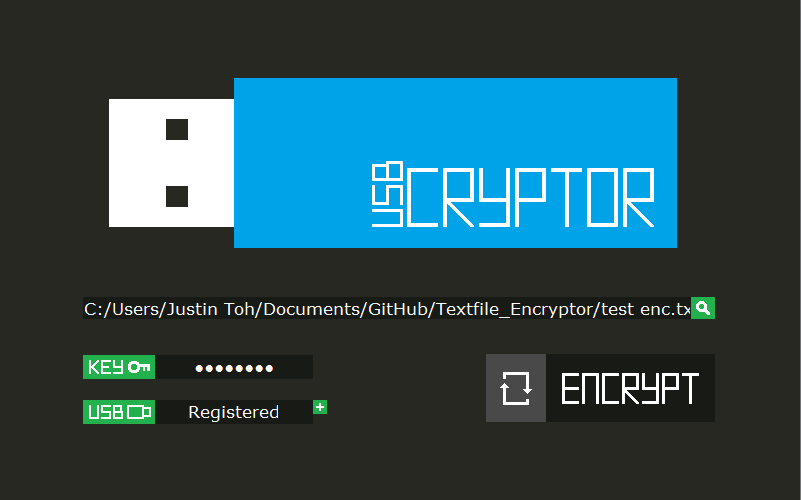

# USBCRYPTOR
Textfile encryptor/decryptor made with Python 3 & Tkinter UI Framework

How it works?
-------
1. When user registers a USB device, the program detects if there's any new device connected to the PC.
2. A function then retrieves the details of this new USB device (via the win32com module) & extracts its [Vendor & Product ID (VID & PID)](http://www.voti.nl/docs/usb-pid.html).
3. An 8-digit KEY (chosen by the user) & the registered device's PID/VID will be converted & concatenated into an ASCII-encoded string (labelled as "keyCode" in class.py).
4. This keyCode is then used for encryption/decryption algorithm that slightly resembles a [polyalphabetic cipher](https://en.wikipedia.org/wiki/Polyalphabetic_cipher).
5. The algorthim works on the principle of adding/subtracting the corresponding ASCII-integer values of keyCode & the strings that we extract out from the input file & encoding the resulting value before writing it into the output file.

How to Encrypt a .txt file:
-------
1. Choose the textfile that you want to encrypt by clicking on the magnifying glass icon
2. Enter a 8-digit numeric KEY
3. Register your USB Flashdrive
4. Toggle & select encryption mode
5. Click on ENCRYPT

How to Decrypt a .txt file:
-------
1. Choose the textfile that you want to decrypt by clicking on the magnifying glass icon
2. Enter the 8-digit numeric KEY used for the encryption process
3. Register your USB Flashdrive used for the encryption process
4. Toggle & select decryption mode
5. Click on DECRYPT

Limitations:
-------
+ Only able to process ASCII characters
+ Program won't work if your text files contains other character encodings (UTF-8 etc.)
